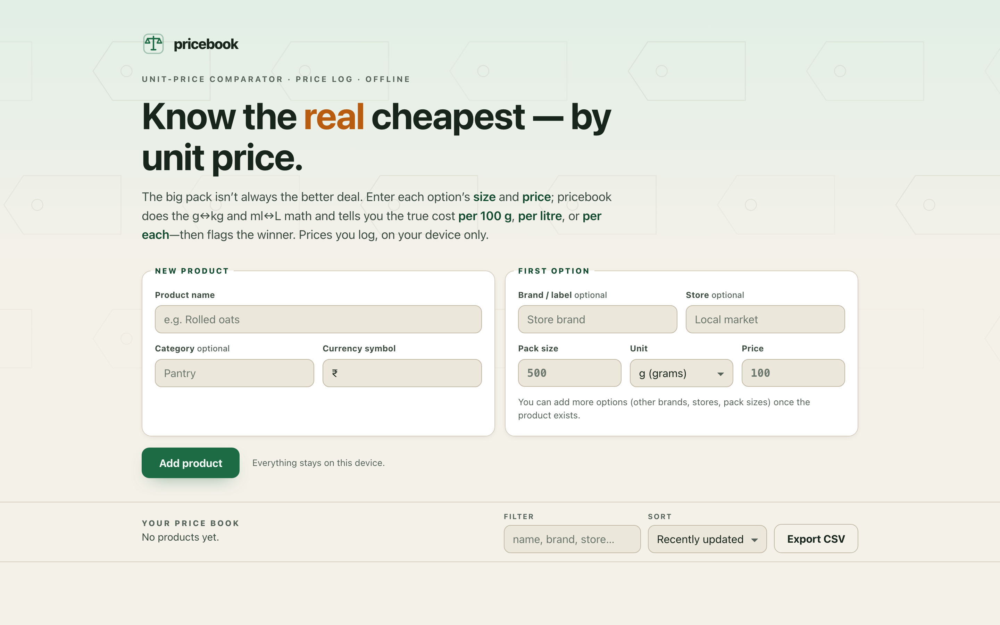

# pricebook

**Know the real cheapest — by unit price.** A private unit-price comparator and price log. Enter each option's package size and price; pricebook does the correct g↔kg and ml↔L conversion and tells you the true cost *per 100 g*, *per litre*, or *per each* — then flags the best value. 100% client-side, zero dependencies, works fully offline.

## Why

The big pack isn't always the better deal, and the shelf rarely makes it easy to tell. One brand sells oats at 500 g for 100; another at 1 kg for 180. The bigger pack has the bigger sticker price, but it's actually *cheaper per gram* — 18 per 100 g versus 20. Doing that arithmetic in your head, across grams and kilograms and litres, in the middle of an aisle, is exactly the kind of thing a small tool should do for you.

pricebook is that tool. You log the products you buy, their competing options (brands, stores, pack sizes), and the price you saw. It normalises everything to a fair unit price, marks the winner, and keeps a dated price log per option so you can watch a trend and remember which store has been cheapest over time.

## Features

- **Correct unit-price math** — weights normalise to price per 100 g, volumes to price per litre, counts to price per each. g↔kg and ml↔L are converted to one base unit first, so `0.5 kg` and `500 g` give the *exact* same unit price.
- **Best-value badge** — the cheapest option per product is flagged, with the options listed cheapest-first. If a product's options span different unit families (say, a weight and a count), pricebook won't pretend they're comparable — it says so instead of crowning a fake winner.
- **Per-option price log** — append dated price entries; see a tiny sparkline, the trend since first logged, and the lowest price ever seen.
- **Side-by-side compare** — a compact compare strip for the product with the most priced options.
- **CSV export** — a clean, RFC 4180 export of every product, option, and price entry (including a recomputed unit price per row), for a spreadsheet.
- **100% offline** — no accounts, no network calls, no tracking. Everything lives in your browser's local storage.

## Quickstart

Just open `index.html` in any modern browser — no build step, no server, no install.

- **Local:** double-click `index.html`, or run a static server in the folder.
- **Hosted:** **[Open pricebook live](https://sreenivas-sadhu-prabhakara.github.io/pricebook/)**

Add a product with its first option, then use **Add option** on the card to add competing brands, stores, or pack sizes. Expand **price log** on any option to record what you paid today. Your whole price book is saved in local storage and persists between visits.

## Privacy

pricebook is private by construction — not by promise.

- A strict Content-Security-Policy sets `connect-src 'none'`: the app **cannot** make any network request even if it tried.
- No external fonts, scripts, images, or analytics. Everything is self-contained; even CSV export uses a `data:` URI, not a network round-trip.
- All logic runs in your browser. The prices and stores you type never leave your device.

## Honest limitation

**These are your own logged prices.** pricebook is *not* a live price feed, and it does *not* scrape stores or crowd-source anything. It shows only what you type in, and its one job is to do the unit-price arithmetic correctly so you don't have to. A logged price is a snapshot from whenever you entered it — always check the current shelf price before you buy.

## Disclaimer

pricebook is provided for general, personal budgeting use only. It performs unit-price arithmetic on figures you supply; it is not financial advice and makes no guarantee that any option is actually the best purchase for you. Prices you log may be out of date. This software is provided under the MIT License, "as is", without warranty of any kind; the authors accept no liability for any loss or damage arising from its use.

## License

[MIT](./LICENSE) © 2026 Sreenivas Sadhu Prabhakara
